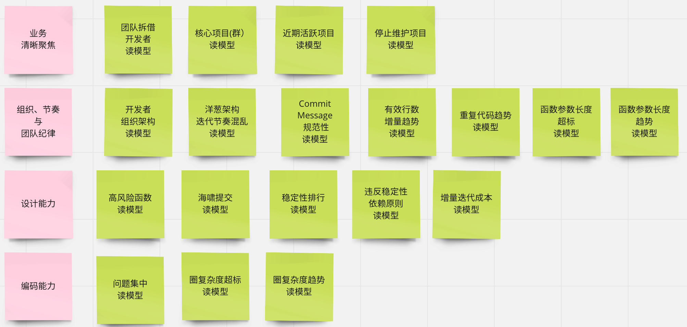
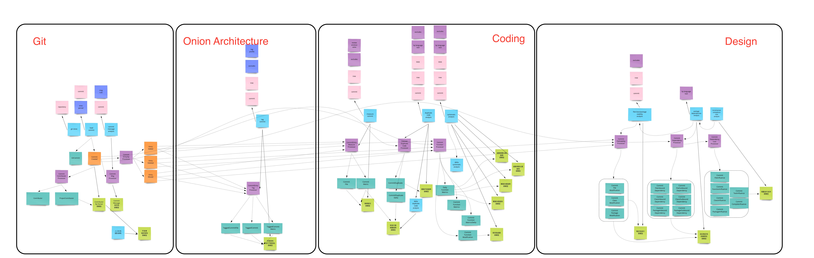

# learning-zio

By upgrading git-stats-backend to a new stage, a production level engineering quality is required. 

To separate technical and business complexity, a side-effect free style and library is a key tool to 'application-core' layer (by onion architecture).
Scala is a great programming language with outstanding productivity, mastering FP and OO at the same time is awesome, but what would be the proper programming model at application core is weathy to try with zio, 
which at least helps align types/monads/effects and separates effectful declaration and implementations.

# Features
As is shown in following picture, these features will be provided by this project:

# Architecture
Logically, the architecture is shown as following picture:

